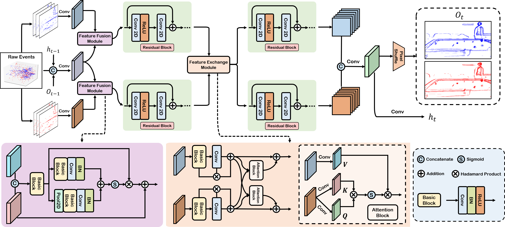

# Efficient Event Stream Super-Resolution with Recursive Multi-Branch Fusion

**Official PyTorch Implementation of the IJCAI 2024 Paper:**

Efficient Event Stream Super-Resolution with Recursive Multi-Branch Fusion **</sub><br><sub>[Supp](doc/supp.pdf)</sub><br>**

<p align="left">
    
  <br>
</p>

## Dataset

Please follow the instructions from directory `generate_dataset` to prepare the synthetic and real-world dataset.

## Pretrained model

Some pretrained model are in the `pretrain` folder.

## Training and Inference

Please check the file `scripts\train_ours.sh` and `scripts\infer_ours.sh` for training and inference. 

## Citation

If you find this work helpful, please consider citing our paper.

```latex
@article{liangefficient,
  title={Efficient Event Stream Super-Resolution with Recursive Multi-Branch Fusion},
  author={Liang, Quanmin and Huang, Zhilin and Zheng, Xiawu and Yang, Feidiao and Peng, Jun and Huang, Kai and Tian, Yonghong}
}
```


## Contact

If you have any problem about the released code, please contact me with email (liangqm5@mail2.sysu.edu.cn).
